# Genres are cool!

The original goal was to use the [MillionSongDataset (MSD)](http://labrosa.ee.columbia.edu/millionsong/)
and machine learning to predict the genre of any given song. But, the MSD contains useful audio features
calculated using proprietary algorithms by EchoNest. Since EchoNest is now owned by Spotify,
those features can only be gathered for songs on Spotify using the [Spotify Web API](https://developer.spotify.com/web-api/get-audio-features/).

To accommodate, the goal of the project is to create a machine learning algorithm that can predict song
genre using those Spotify audio features. To do this, a new database of features must be generated using
the MSD and Spotify Web API.

## 1. Requirements

The project depends on the Python 2.7 SciPy stack plus some other dependencies. The best way to set this up is to use one of the
[SciPy-stack compatible Python distributions](http://www.scipy.org/install.html) (for instance, Anaconda) to install Python into an `env` folder,
then run `pip install -r requirements.txt` inside the env. The packages used are:

 - PyYAML
 - spotipy
 
TensorFlow is also required. Install it using the [TensorFlow Download and Setup guide](https://www.tensorflow.org/versions/r0.10/get_started/os_setup.html#download-and-setup).
If you're using Anaconda on Linux, this is very easy. Even easier, you can use the docker image included in this repo.
First, [download Docker](https://www.docker.com/products/overview). CD into the `docker` directory, and execute
`docker build -t tf .` to build the Docker image as the image named `tf`. On Windows, you can now use the included
`docker_tf.bat` to execute `run.py` commands in the Docker image, i.e. `docker_tf train`.
 
Spotify OAuth credentials are needed to get song analysis information. Copy `config_sample.yml` to a new file 
`config.yml` and replace the Spotify client_id and client_secret with your OAuth credentials.
 
 
## 2. Data

The whole MSD is not actually needed, as the relevant features will be grabbed using the Spotify Web API.
In place of the whole MSD, we will use the [database linking EchoNest track id to song id](http://labrosa.ee.columbia.edu/millionsong/sites/default/files/AdditionalFiles/unique_tracks.txt).
Place this file in `data/MSD/unique_tracks.txt`.

To associate Spotify track id with each EchoNest song id, we will use the [AcousticBrainz mapping archive](http://labs.acousticbrainz.org/million-song-dataset-echonest-archive).
Extract the .tar.bz2 file to `data/foreign/`
(the directory structure should look like `data/foreign/AA/`, `data/foreign/AB/`, `data/foreign/AC/`, etc.).

Lastly, a genre mapping for the MSD is needed. There are several available:
  
 - [last.fm dataset](http://labrosa.ee.columbia.edu/millionsong/lastfm)
 - [tagtraum genre annotations](http://www.tagtraum.com/msd_genre_datasets.html)
 - [yajie hu's genre tagging](http://web.cs.miami.edu/home/yajiehu/resource/genre/index.html)

The project has been tested to work with either the tagtraum or yajie dataset. The charts and analysis done
are only done with the tagtraum_cd2c dataset.

If using the tagtraum dataset, pick either [msd_tagtraum_cd2](http://www.tagtraum.com/genres/msd_tagtraum_cd2.cls.zip)
or [msd_tagtraum_cs2c](http://www.tagtraum.com/genres/msd_tagtraum_cd2c.cls.zip) and unzip it to 
`data/tagtraum/FILE.cls`. 

If using yajie hu's mapping, extract it to `data/GenreTags/GenreTags.txt`.

Change the `genre_dataset` key in `config.yml` to either `tagtraum_cd2`, `tagtraum_cd2c`, or `yaji`, matching
the choice you made.

## 3. Building the database

Firstly, the new Spotify database has to be built. To do this, run `python run.py build`. This might take a while as it can only
get information for 100 songs at a time from Spotify and sleeps for 15 seconds every 100 queries to avoid rate limiting.

After it is finished, the file `data/db/all.db` should be created, and if explored with a SQLite
explorer will show about 27,000 entries using tagtraum's cd2c.

## 4. Graphs

Running `python run.py graph` will generate graphs for the data. It will also prepare CSV data for TensorFlow.

Some multipliers are specified in `genres.features.MULTIPLIERS` to scale all the data to around the same range
(somewhere in the power of 10^2). This is done so the classifier performs better

### `tagtraum_cd2c` dataset
#### Sample data:

| class 	| genre      	| count 	|
|-------	|------------	|-------	|
| 0     	| Electronic 	| 2895  	|
| 1     	| Metal      	| 1215  	|
| 2     	| Jazz       	| 1888  	|
| 3     	| RnB        	| 1219  	|
| 4     	| Rock       	| 10766 	|
| 5     	| World      	| 290   	|
| 6     	| Reggae     	| 1100  	|
| 7     	| Pop        	| 1757  	|
| 8     	| Rap        	| 1430  	|
| 9     	| Country    	| 1225  	|
| 10    	| Folk       	| 675   	|
| 11    	| Latin      	| 464   	|
| 12    	| Punk       	| 480   	|
| 13    	| Blues      	| 840   	|
| 14    	| New Age    	| 173   	|

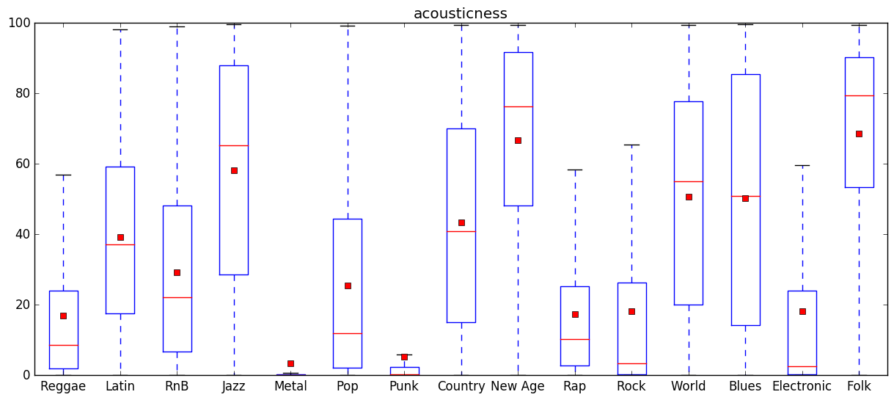

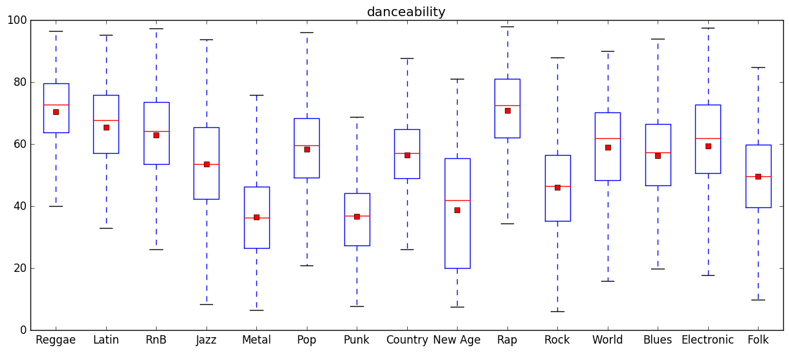

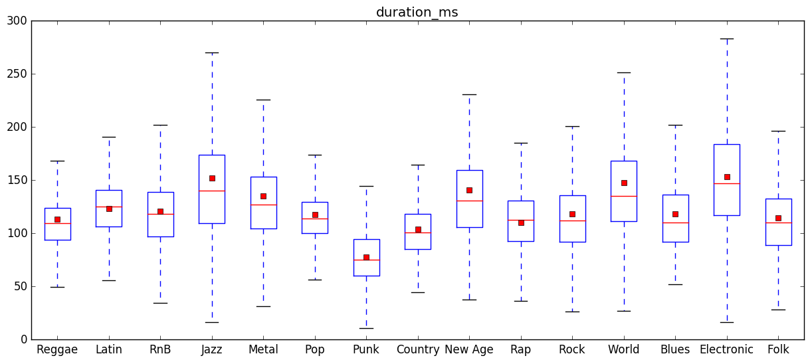

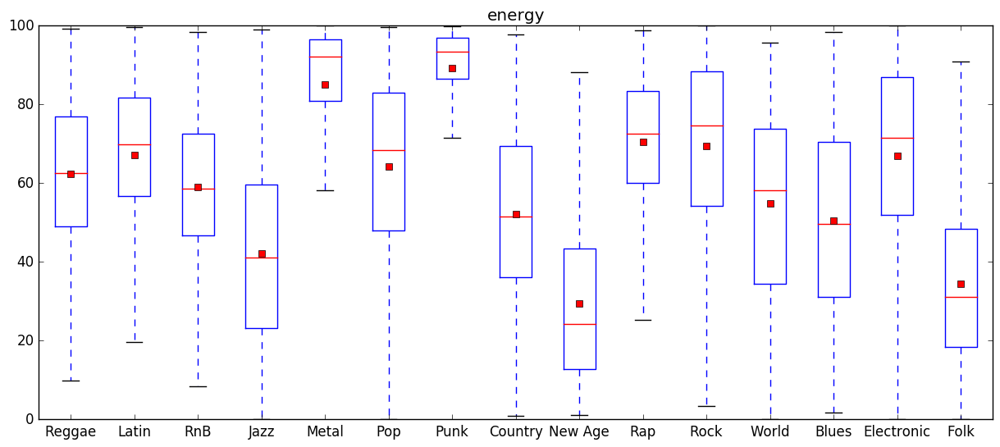

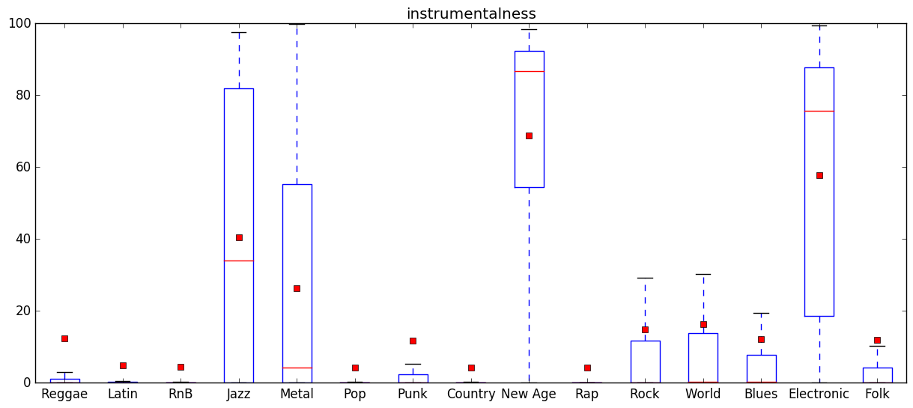

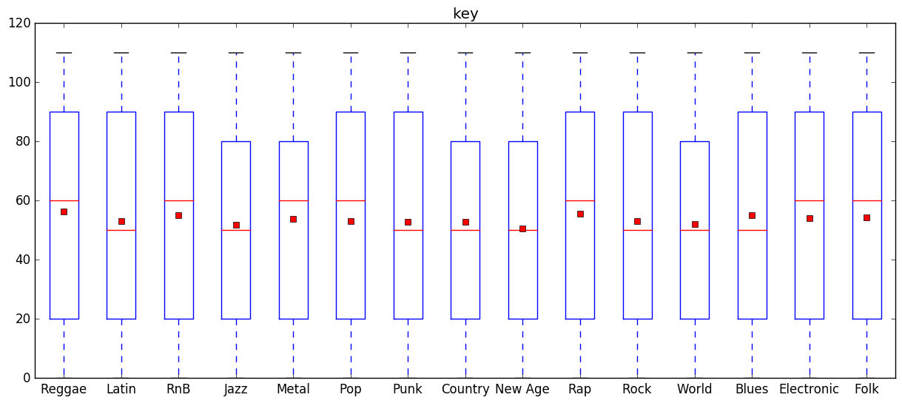

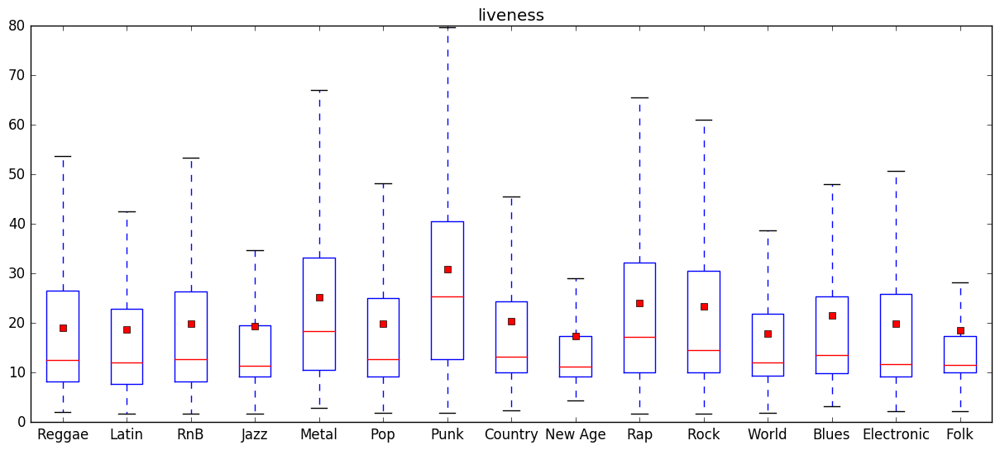

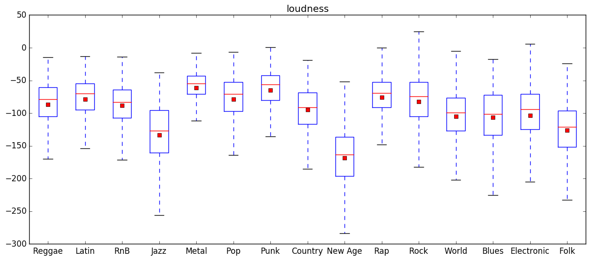

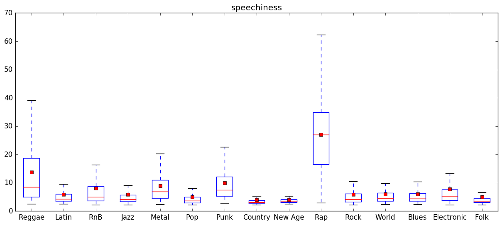

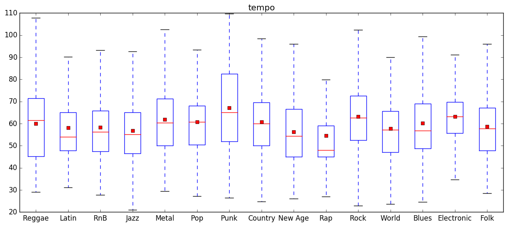

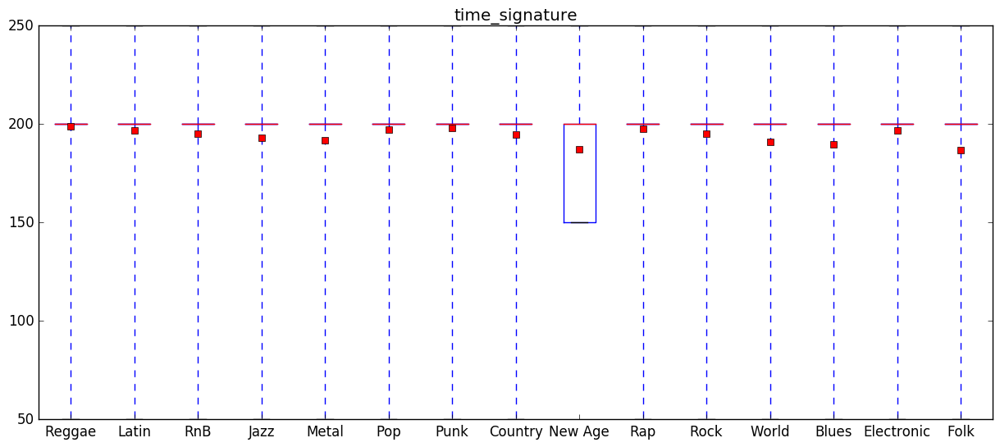

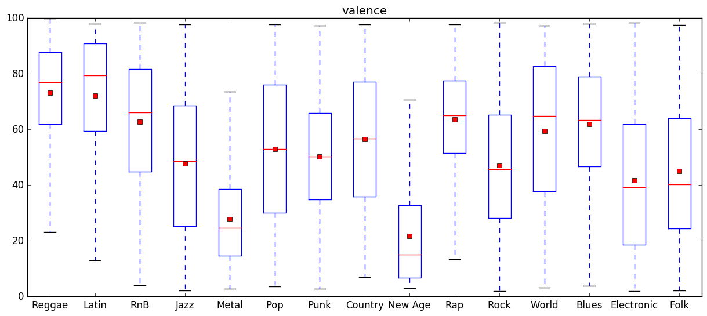

## 5. Train

With data ready, all that's left is to configure the network before starting training. Example values are given
in the `network` section of `config_example.yml`. These are also the values used to generate any models or
graphs following this point.
 
Start training by running `python run.py train`. To run this through the repo's
Docker image, run `docker_tf train`. Accuracy per epoch is stored in `training_data.csv`.

The training can be stopped at any time via `Ctrl+C`, and (assuming it hasn't lapsed every epoch given in the config)
it will be resumed from where it left off by using the `checkpoint` files stored in `%out_folder%/model`.

## 6. Classify

With the model trained, any track on Spotify can be classified using the network! To do so, run
either `python run.py classify -t "track_id"` or `python run.py classify -s "search terms"`. This still depends
on TensorFlow, so if you've been running TensorFlow through the included Docker image you should run
`docker_tf run.py classify <your parameters>`. 

A pre-trained model is available in the `model` folder. To use it, copy it to `out_folder/model` 
(by default, this is `data/out/model`).

## References

- https://github.com/tbertinmahieux/MSongsDB for extracting information from the MSD
- for building the model: 
    - https://www.tensorflow.org/versions/r0.10/tutorials/mnist/pros/index.html
    - https://github.com/nlintz/TensorFlow-Tutorials
    - http://r2rt.com/implementing-batch-normalization-in-tensorflow.html (batch normalization)

